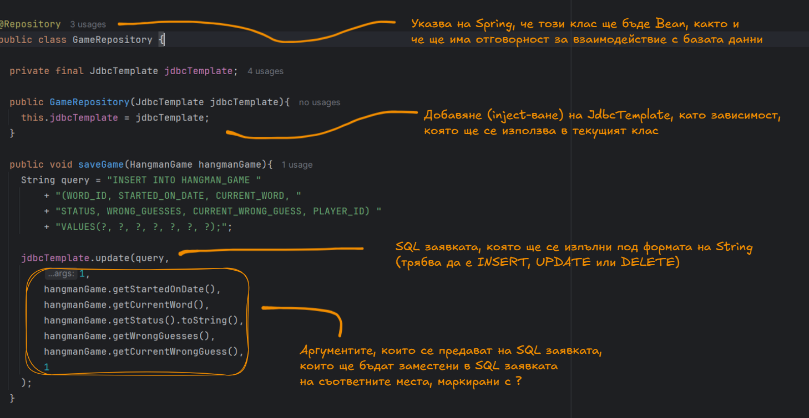
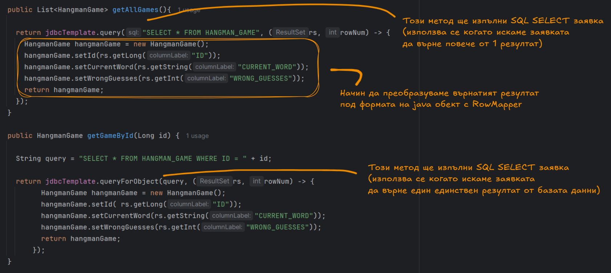
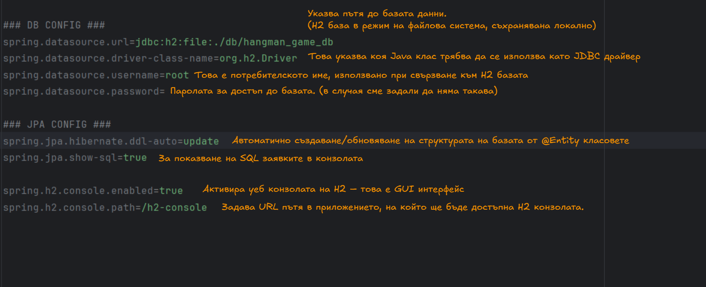
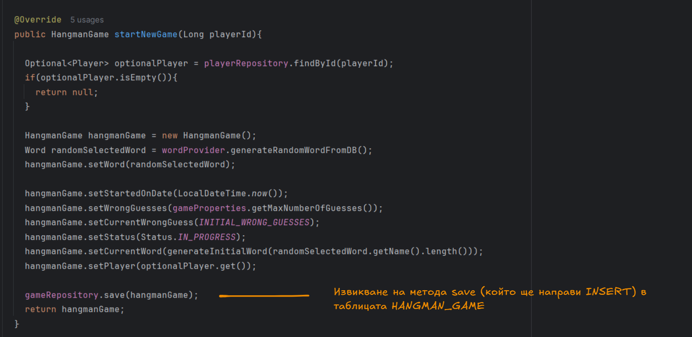

# ***Работа с база данни използвайки Spring JDBC и Spring Data***

## Въведение
В четвъртото занятие се фокусирахме върху работата с бази данни в контекста на Spring Boot приложения. 
Запознахме се с трислойната архитектура на уеб приложенията и как се прилага тя с помощта на Spring Data JPA 
за достъп до данни. Разгледахме концепцията за разделяне на логиката на нива (presentation, service, persistence),
което води до по-добра организация и поддръжка на кода.

Основните теми в това занятие включват:
- Работа със Spring Data JPA – създаване на интерфейси, разширяващи JpaRepository, и
използване на query методи за достъп до данни без нужда от писане на SQL заявки.
- Имплементиране на Repository Pattern, който абстрахира детайлите на достъпа до базата 
- Конфигуриране на връзка с база данни (H2) и използване на Spring Boot свойства за конфигурация.
- Генериране на SQL схеми чрез JPA анотации като @Entity, @Id, @GeneratedValue, @Column, @ManyToOne и др.
- Използване на Lombok за премахване на boilerplate код чрез анотации като @Getter, @Setter, @NoArgsConstructor, @AllArgsConstructor, @ToString.

В този документ се обобщават основните концепции и практически насоки, свързани с:
- Работа с база данни чрез Spring Data JPA
- Организация на проект с трислойна архитектура
- Създаване и използване на Repository интерфейси
- Мапинг на Java обекти към базови таблици чрез JPA
- Улесняване на работата с Java класов чрез Lombok

## Съдържание
- [Работа с база данни в Spring](#db-spring)
- [Какво е трислойна архитектура ?](#three-tier-architecture)
- [Repository pattern](#repository-pattern)
- [Как да използваме Spring Data JPA ?](#spring-data)
- [Lombok](#lombok)
- [Допълнителни материали](#resources)

<a id="db-spring"></a>
## I. Работа с база данни в Spring

При работата с бази данни и съставянето/използването на SQL съществуват
различни школи или стилове, които обхващат различни подходи и парадигми.

### Основни школи:

#### 1. Raw SQL (Сурови SQL заявки):
- Ръчно написан SQL (SELECT, INSERT и т.н.)
- uзползване на драйвер за комуникация с даден сървър за управление на бази данни
- Предимства:
    + голям контрол върху данните в базата
    + добра производителност
    + подходящо за сложни заявки или оптимизации
- Недостатъци:
    + голям контрол върху данните в базата
    + по-трудна поддръжка
    + много boilerplate

#### 2. ORM (Object-Relational Mapping):
- връзка м/у кода и базата данни (с анотации)
- aвтоматично генериране на SQL заявки
- User.java == USER table
- Предимства:
    + по-малко код
    + обектно-ориентиран стил
    + разкачване от базата данни
- Недостатъци:
    + може да е по-бавно при големи заявки
    + липса на пряка комуникация м/у дев и базата данни
    + "скрити" SQL заявки
    + може да е неефективно за сложни заявки

<a id="three-tier-architecture"></a>
## II. Какво е трислойна архитектура ?

Трислойната архитектура е популярен архитектурен модел
в разработката на софтуерни приложения, който разделя приложението на три основни слоя,
всеки с ясно определена роля. Това разделение улеснява поддръжката, повторната употреба на код и мащабирането.

### Основните слоеве са:

#### 1. Презентационен слой (Presentation Layer)
- Отговаря за взаимодействието с потребителя
- Представя потребителския интерфейс (UI)
- Изпраща заявки към логическия слой
- Получава и визуализира резултати.
- Не съдържа бизнес логика
> Примери: уеб страница (HTML/CSS/JavaScript), мобилно приложение, React фронтенд.

#### 2. Слой за бизнес логиката (Business Logic Layer / Application Layer)
- Съдържа бизнес логиката на приложението — правилата, които управляват данните и процесите
- Обработва заявки от презентационния слой, извиква необходимите услуги и връща резултатите
- Проверка на валидност на данните
- Връзка със слоя за данни
> Примери: Java Spring Boot, .NET Core, Node.js сървър.

#### 3. Слой за достъп до данни (Data Access Layer / Persistence Layer)
- Отговаря за съхраняването и извличането на данни от базата данни
- Изолира логиката на приложението от конкретни детайли за съхранение
- Изпълнение на SQL заявки
- Съхраняване и извличане на обекти
> Примери: JPA, Hibernate, JDBC, SQL заявки.

### В контекста на Spring:

#### Презентационен слой – Controller
- Реализира се чрез @RestController или @Controller
- Приема HTTP заявки (GET, POST, PUT, DELETE и др.)
- Извиква методи от сервизния (бизнес) слой

#### Бизнес логически слой – Service
- Бележи се с @Service
- Съдържа бизнес логика: валидации, обработка, трансформации
- Извиква репозитория/слоя за достъп до данни

#### Слой за достъп до данни – Repository
- Бележи се с @Repository
- Интерфейс, обикновено наследяващ JpaRepository

<a id="repository-pattern"></a>
## III. Repository pattern (Слой за достъп до данни)

Repository Pattern е архитектурен шаблон, който осигурява абстракция между бизнес логиката и базата данни. 
Той скрива детайлите на достъпа до базата данни зад интерфейс, така че бизнес логиката
(сервизните класове) не "знаят" как точно се извличат данните – те просто извикват методи от репозитория.

### 1. Какво е @Repository?

@Repository е специална Spring анотация, която указва, че даден клас е компонент
от слоя за достъп до данни и трябва да бъде управляван от Spring контейнера.

- Така Spring знае, че това е компонент, който работи с базата данни.
- Когато използваш JpaRepository, не е задължително ръчно да слагаш @Repository, защото Spring автоматично го обработва чрез @EnableJpaRepositories.

### 2. Начини за достъп до persistent ресурс

#### 2.1 Spring JDBC (JdbcTemplate):
JdbcTemplate е част от Spring JDBC module и представлява обвивка около стандартния JDBC API. Тя:
- опростява работата с базата,
- премахва нуждата от повтарящ се boilerplate код,
- улеснява изпълнението на SQL заявки.

#### Работа с библиотеката:

- Зависимости:
```xml
<dependency>
    <groupId>org.springframework.boot</groupId>
    <artifactId>spring-boot-starter-jdbc</artifactId>
</dependency>
```

- Зависимост за H2 база
```xml
<dependency>
    <groupId>com.h2database</groupId> 
    <artifactId>h2</artifactId>
</dependency>
```





#### Предимства:
- когато използваш JdbcTemplate, пишеш директно SQL заявки, което ти дава пълен контрол върху SQL кода
- полезно, когато искаш да оптимизираш конкретни заявки
- jdbcTemplate е лесен за конфигуриране и интегриране със Spring приложения
- за разлика от ORM подходите, които включват допълнителни слоеве абстракция (JdbcTemplate е по-лек и по-бърз, тъй като работи директно със SQL)
- с помощта на RowMapper може лесно да мапнеш резултата от SQL заявка в Java обекти

#### Недостатъци:
- В Spring JDBC трябва да пишеш ръчно SQL заявки. Това може да стане досадно, 
ако проектът включва много таблици или сложни заявки, които трябва да бъдат поддържани
- можеш лесно да пропуснеш оптимизации или да правиш грешки в синтаксиса на SQL.
- за разлика от JPA, който работи с entities и предоставя автоматично мапване
между базата данни и обектите, тук трябва да използваш SQL и RowMapper за всяка таблица.

#### 2.2  Spring Data JPA (Repository абстракция)
Spring Data JPA е мощен модул от Spring Framework, който предоставя 
абстракция върху достъпа до базата данни, като автоматизира голяма част
от писането на SQL код и предоставя лесен начин за работа с бази данни 
чрез JPA (Java Persistence API). Това се постига чрез дефиниране на
Repository интерфейси, които Spring автоматично имплементира в реално време.

- позволява работа с бази данни чрез Entity обекти;
- автоматично генерира SQL заявки чрез имената на методите;

#### Основни компоненти на Spring Data JPA:

- Entity – Java клас, който отговаря на таблица в базата данни.
- Repository интерфейс – интерфейс, чрез който се дефинират CRUD операции.

#### Работа с библиотеката:

- Зависимости:
```xml
<dependency>
  <groupId>org.springframework.boot</groupId>
  <artifactId>spring-boot-starter-data-jpa</artifactId>
</dependency>
```

- Зависимост за H2 база
```xml
<dependency>
    <groupId>com.h2database</groupId> 
    <artifactId>h2</artifactId>
</dependency>
```
#### Предимства:
- бърза разработка – не пишеш SQL или имплементации.
- Само с няколко реда код (чрез интерфейс, който наследява JpaRepository)
  получаваш автоматично готови методи за save, findById, deleteById, findAll и др.
- генерирането на заявки се базира на имената на методите (например findByUsernameAndEmail()).
- интерфейсите, които разширяват JpaRepository, не изискват ръчна имплементация – Spring Boot ги открива и създава реални обекти зад кулисите.
- при нужда от по-сложни заявки можеш да използваш @Query с JPQL или дори native SQL

#### Недостатъци:
- не виждаш ясно SQL-а, който се изпълнява
- може да доведе до неочаквано поведение или неоптимални заявки

<a id="spring-data"></a>
## IV. Как да използваме Spring Data JPA ?

### 1. Добавяне на конфигурация:
  
След като сме добавили съответните зависимости в нашият проект е
нужно да добавим и малко конфигурация която ще осигури работеща връзка
между Spring Boot, Spring Data JPA и релационна база от данни (в случая H2).



### 2. Създаване на Entity класовете
Entity класовете са Java обекти, които представляват таблици в релационна база данни. 
Те са основна част от JPA (Java Persistence API) и Spring Data JPA и се използват, 
за да описват структурата на данните, които се съхраняват в базата.

> Когато даден Java клас е анотиран с @Entity, това казва на JPA:
> - „Този клас представлява таблица в базата данни, а полетата му са колони.“

#### 2.1 Добавяне на @Entity
Добави анотацията @Entity, за да кажеш на JPA, че този клас трябва да се свърже с таблица.

```java
@Entity
public class HangmanGame {
  
}
```

#### 2.2 Свързване класа с таблица (по избор)
Тази анотация също може да определи името на таблицата в базата данни

```java
@Entity
@Table(name = "HANGMAN_GAME")
public class HangmanGame {

}
```
#### 2.3 Дефиниране първичен ключ с @Id и @GeneratedValue
Всяка таблица трябва да има първичен ключ. 
Полето се анотира с `@Id`, а стойността му може да се генерира автоматично:
- `@GeneratedValue(strategy = GenerationType.IDENTITY)` указва, че се използва auto-increment

```java
@Entity
@Table(name = "HANGMAN_GAME")
public class HangmanGame {

  @Id
  @GeneratedValue(strategy = GenerationType.IDENTITY)
  private Long id;
  
  // getter-и и setter-и ...
}
```
#### 2.4 Добави полета – те ще станат колони

- С `@Column` можеш да зададеш конкретни настройки. Параметри на анотацията `@Column`:

| Параметър | Значение                                      |
|-----------|-----------------------------------------------|
| `name`    | Име на колоната в базата                      |
| `nullable`| Позволява ли се `null` (по подразбиране: `true`) |
| `unique`  | Дали стойността трябва да е уникална          |
| `length`  | Дължина (важно при `VARCHAR`, напр. `length=50`) |

- С @Enumerated(EnumType.STRING) - укажеш как да се съхранява Enum тип в базата данни.
По подразбиране, ако имаш Enum поле в Entity клас, JPA не знае как точно да го запише – дали като число (ordinal) или като текст (име на Enum елемента)

Разлики между `EnumType.ORDINAL` и `EnumType.STRING`

| Тип на `EnumType`    | Съхранена стойност в базата                | Пример               |
|----------------------|-------------------------------------------|----------------------|
| `EnumType.ORDINAL`    | Позицията на Enum стойността (индекс: 0, 1, 2, ...) | `ACTIVE` -> 0, `INACTIVE` -> 1 |
| `EnumType.STRING`     | Името на Enum стойността като текст (напр. "ACTIVE") | `ACTIVE`, `INACTIVE` |

```java
@Entity
@Table(name = "HANGMAN_GAME")
public class HangmanGame {

  @Id
  @GeneratedValue(strategy = GenerationType.IDENTITY)
  @Column(name = "GAME_ID", nullable = false)
  private Long id;

  @Column(name = "STARTED_ON_DATE")
  private LocalDateTime startedOnDate;

  @Column(name = "CURRENT_WORD", nullable = false, length = 100)
  private String currentWord;

  @Enumerated(EnumType.STRING)
  private Status status;

  @Column(name = "WRONG_LETTERS")
  private String wrongLetters;

  @Column(name = "WORD_GUESSES", nullable = false)
  private int wrongGuesses;

  @Column(name = "CURRENT_WRONG_GUESS", nullable = false)
  private int currentWrongGuess;

  // getter-и и setter-и ...
}
```

#### 2.5 Добавянето на релации между Entity класове
Добавянето на релации между Entity класове в JPA е много важно за дефинирането на как 
се свързват таблиците в базата данни. В JPA има няколко основни анотации за описване на връзки (релации) между таблици:

Основни релации в JPA:

- `@OneToOne`:
Тази анотация описва релацията между две таблици, където една стойност в едната таблица съответства на една стойност в другата. 

- `@OneToMany`:
Тази анотация се използва, когато една стойност в едната таблица съответства
на много стойности в другата таблица (например, един потребител има много поръчки).

- `@ManyToOne`:
Тази анотация се използва, когато много стойности в едната таблица съответстват на една стойност в другата таблица.

- `@ManyToMany`:
Тази анотация се използва, когато много стойности в едната таблица могат да бъдат свързани с много стойности в другата таблица.

`@JoinColumn`:
Тази анотация се използва, за да посочиш колоната, която ще съдържа външен ключ в релациите.


```java
@Entity
@Table(name = "HANGMAN_GAME")
public class HangmanGame {

  @Id
  @GeneratedValue(strategy = GenerationType.IDENTITY)
  @Column(name = "GAME_ID", nullable = false)
  private Long id;

  // другите полета на класа ...

  @ManyToOne
  @JoinColumn(name = "WORD_ID", referencedColumnName = "ID")
  private Word word;

  @ManyToOne
  @JoinColumn(name = "PLAYER_ID", referencedColumnName = "ID")
  private Player player;

  // getter-и и setter-и ...
}
```

**Обяснение на създаването на релация с друго entity (таблица):**

**Създаване на релация с Word**

- `@ManyToOne`: Това показва, че всяка игра може да бъде свързана с една дума
(множество игри могат да използват една и съща дума). 
Това е много към едно отношение, тъй като много записи в HANGMAN_GAME могат да имат същата дума.

- `@JoinColumn(name = "WORD_ID")`: Това определя името на колоната в таблицата HANGMAN_GAME, 
която ще съдържа външния ключ към таблицата WORD. В този случай, колоната ще бъде WORD_ID.

- `referencedColumnName = "ID"`: Това указва, че колоната, към която сочи външният ключ,
е колоната ID в таблицата WORD. Тоест, WORD_ID в таблицата HANGMAN_GAME ще сочи 
към стойността на ID в таблицата WORD.

```java
@ManyToOne
@JoinColumn(name = "WORD_ID", referencedColumnName = "ID")
private Word word;
```

Така изглежда съответното entity Word (което в базата данни ще има таблица WORD)
```java
@Entity
@Table(name = "WORD")
public class Word {

  @Id
  @GeneratedValue(strategy = GenerationType.IDENTITY)
  private Long id;

  @Column(name = "NAME", nullable = false, length = 100)
  private String name;

  // getter-и и setter-и ...
}
```

**Създаване на релация с Player**

- `@ManyToOne`: Това показва, че всяка игра е свързана с един потребител (играч), 
но много игри могат да бъдат свързани с един и същи играч. Това е също много към едно отношение.

- `@JoinColumn(name = "WORD_ID")`: Това указва името на колоната в таблицата HANGMAN_GAME,
която ще съдържа външния ключ към таблицата PLAYER. Колоната ще се казва PLAYER_ID

- `referencedColumnName = "ID"`: Това указва, че колоната, към която сочи външният ключ,
е колоната ID в таблицата PLAYER. Тоест, стойността в колоната PLAYER_ID ще съответства на
стойността в колоната ID на таблицата PLAYER.

```java
@ManyToOne
@JoinColumn(name = "PLAYER_ID", referencedColumnName = "ID")
private Player player;
```

Така изглежда съответното entity Player (което в базата данни ще има таблица PLAYER)

```java
@Entity
@Table(name = "PLAYER")
public class Player {

  @Id
  @GeneratedValue(strategy = GenerationType.IDENTITY)
  @Column(name = "ID")
  private Long id;

  @Column(name = "USERNAME", nullable = false, length = 150)
  private String username;

  // getter-и и setter-и ...
}
```

### 3. Създаване на съответно Repository

След като си създал Entity класовете, следващата стъпка е да създадеш Repository класовете,
които ще отговарят за достъпа до базата данни и ще позволяват извършване на
CRUD (Create, Read, Update, Delete) операции върху съответните Entity класове.
В Spring Data JPA, Repository слоят предоставя абстракция за работа с базата данни
и е лесен за използване благодарение на вградените интерфейси и анотации.

#### Стъпка 1: Създаване на Repository интерфейс

1. Създаваш интерфейс за всеки Entity клас.
2. Интерфейсът наследява от JpaRepository или CrudRepository.
3. Можеш да дефинираш специфични методи за заявки към базата данни, 
ако вградените методи не са достатъчни.

```java
public interface GameRepository extends JpaRepository<HangmanGame, Long> {

  // Можеш да добавиш специфични методи тук (по избор)
  
  // SELECT * FROM HANGMAN_GAME
  // WHERE STATUS = ?
  List<HangmanGame> findByStatus(Status status);

}
```
`JpaRepository<HangmanGame, Long>`:
- Първият параметър (HangmanGame) указва Entity класа, с който ще работи този репозитори.
- Вторият параметър (Long) е типът на идентификатора (първичния ключ) на Entity класа.

С това ще можеш да извършваш стандартни CRUD операции като:

- save(): Записва или актуализира обект в базата данни.
- findById(): Намира обект по ID.
- findAll(): Намира всички обекти от таблицата.
- deleteById(): Изтрива обект по ID.

#### Стъпка 2: Използване на Query Methods в Repository

Spring Data JPA може автоматично да създаде заявката, ако спазиш правилна структура на името на метода.

Именованите методи, наричани още Derived Queries, са един от най-използваните и удобни начини за създаване на заявки
в Spring Data JPA. Те позволяват автоматично генериране на SQL заявки само чрез
имената на методите в Repository интерфейсите. Няма нужда да пишеш SQL – Spring
разбира какво искаш да направиш, ако следваш определен синтаксис.

**Общ преглед**

Spring Data JPA позволява автоматично създаване на заявки чрез имената на методите. 
Това са т.нар. "Derived Queries". Следвайки определени правила в именуването, 
Spring генерира SQL или JPQL заявки без нужда от писане на код за самата заявка.

| Категория                         | Ключови думи / Синтаксис                                    | Описание                                                                                  |
|----------------------------------|--------------------------------------------------------------|-------------------------------------------------------------------------------------------|
| **Начало на заявка**             | `findBy`, `readBy`, `getBy`                                 | Еквивалентни начални префикси – извличат данни от базата                                |
| **Логически оператори**          | `And`, `Or`                                                  | Комбинация на условия: `findByNameAndStatus`                                             |
| **Между две стойности**         | `Between`                                                    | `findByAgeBetween(min, max)`                                                             |
| **Сравнение**                   | `LessThan`, `LessThanEqual`, `GreaterThan`, `GreaterThanEqual` | Сравнения по стойности: `findBySalaryGreaterThan(1000)`                                |
| **Подобие с wildcards (%)**     | `Like`, `NotLike`                                            | `findByNameLike("A%")`                                                                   |
| **LIKE %value%**                | `Containing`                                                 | Частично съвпадение: `findByDescriptionContaining("word")`                              |
| **LIKE value%**                 | `StartingWith`                                               | Със започваща стойност: `findByNameStartingWith("A")`                                   |
| **LIKE %value**                 | `EndingWith`                                                 | Със завършваща стойност: `findByNameEndingWith("Z")`                                    |
| **В списък от стойности**       | `In`, `NotIn`                                                | `findByStatusIn(List<Status>)`                                                           |
| **Проверка за NULL**            | `IsNull`, `IsNotNull`                                       | `findByEmailIsNull()`                                                                    |
| **Игнориране на case**          | `IgnoreCase`                                                 | `findByUsernameIgnoreCase("admin")`                                                      |
| **Сортиране**                   | `OrderBy<Field>Asc/Desc`                                    | `findByStatusOrderByCreatedDateDesc()`                                                   |

---

**Комбинация от условия**
```java
List<User> findByNameContainingAndStatusOrAgeGreaterThan(String name, String status, int age);
```

#### Стъпка 3: Използване на Repository в Service Layer

След като направим Dependency Injection на създаденото Repository, вече
може да го използваме в нашият Service клас:




<a id="lombok"></a>
## V. Lombok
Lombok е библиотека, която значително намалява boilerplate кода в Java, 
като автоматично генерира конструктори, getter-и, setter-и и други 
методи чрез анотации.

### 📌 Основни Lombok анотации

| Анотация                | Описание |
|-------------------------|----------|
| `@Getter`               | Създава публични `getter` методи за всички полета на класа или само за конкретно поле. |
| `@Setter`               | Създава публични `setter` методи за всички полета на класа или само за конкретно поле. |
| `@ToString`             | Генерира `toString()` метод. По подразбиране включва всички нестатични полета. Може да се изключи поле с `@ToString.Exclude`. |
| `@EqualsAndHashCode`    | Генерира `equals()` и `hashCode()` методи на база на полетата на класа. |
| `@NoArgsConstructor`    | Генерира конструктор без аргументи. |
| `@RequiredArgsConstructor` | Генерира конструктор само за `final` полета и полета с `@NonNull`. |
| `@AllArgsConstructor`   | Генерира конструктор за всички полета в класа. |
| `@Data`                 | Комбинация от: `@ToString`, `@EqualsAndHashCode`, `@Getter` на всички полета, `@Setter` на всички полета и `@RequiredArgsConstructor`. |

<a id="resources"></a> 
## VI. Допълнителни материали

- [Създавене на query методи](https://docs.spring.io/spring-data/jpa/reference/repositories/query-methods-details.html#repositories.query-methods.query-creation)
- [Лимитиране и сортиране на резултата на query метода](https://docs.spring.io/spring-data/jpa/reference/repositories/query-methods-details.html#repositories.limit-query-result)
